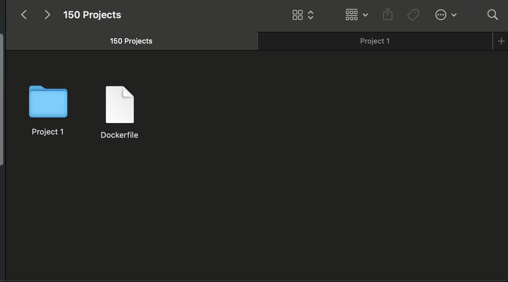
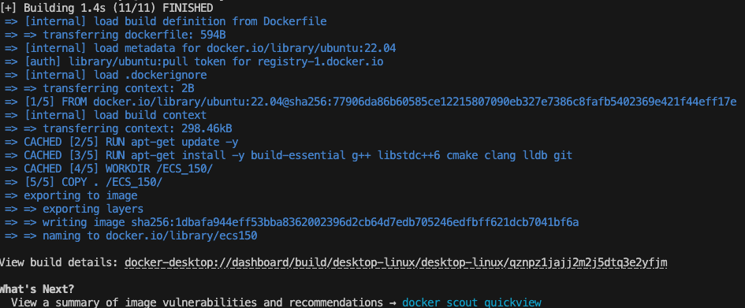

<!-----

You have some errors, warnings, or alerts. If you are using reckless mode, turn it off to see inline alerts.
* ERRORs: 0
* WARNINGs: 0
* ALERTS: 5

Conversion time: 1.231 seconds.

Using this Markdown file:

1. Paste this output into your source file.
2. See the notes and action items below regarding this conversion run.
3. Check the rendered output (headings, lists, code blocks, tables) for proper
   formatting and use a linkchecker before you publish this page.

Conversion notes:

* Docs to Markdown version 1.0β35
* Thu Apr 04 2024 18:38:48 GMT-0700 (PDT)
* Source doc: Docker Instructions
* This document has images: check for >>>>>  gd2md-html alert:  inline image link in generated source and store images to your server. NOTE: Images in exported zip file from Google Docs may not appear in  the same order as they do in your doc. Please check the images!

----->

>>>>>  gd2md-html alert:  ERRORs: 0; WARNINGs: 0; ALERTS: 5.

<ul style="color: red; font-weight: bold"><li>See top comment block for details on ERRORs and WARNINGs. <li>In the converted Markdown or HTML, search for inline alerts that start with >>>>>  gd2md-html alert:  for specific instances that need correction.</ul>

Links to alert messages:
<a href="#gdcalert1">alert1</a>
<a href="#gdcalert2">alert2</a>
<a href="#gdcalert3">alert3</a>
<a href="#gdcalert4">alert4</a>
<a href="#gdcalert5">alert5</a>

>>>>> PLEASE check and correct alert issues and delete this message and the inline alerts.

## Getting Started:

In ECS 150 we’re going to use Docker to help make sure that your project development environment matches what you’ll have when we autograde your homework in Gradescope. By ensuring that the environments are the same, we will eliminate a large class of difficult-to-debug issues that come from inconsistencies. This document outlines the basics of how to get started using Docker on your computer.

**Install Docker **using the instructions [here](https://docs.docker.com/get-docker/). There are two installation methods listed, both are viable and will install the Docker CLI.

**Validate Docker installation** by typing ‘docker’ in the command line.

## Setting up a working directory:

**Create a working directory** by creating a folder on your local machine.

**Put the Dockerfile in the working directory**, this is the root of your working directory.

>>>>>  gd2md-html alert: inline image link here (to images/image1.png). Store image on your image server and adjust path/filename/extension if necessary.  (<a href="#">Back to top</a>)(<a href="#gdcalert2">Next alert</a>) >>>>> 

## Building a Docker Image and Running the Container:

**Run the following commands**:

1. **docker  build -t &lt;name of the image> .**

     \
What it does → ‘docker build’ creates a docker image with the name after ‘-t’, using the Dockerfile in the directory ‘.’ (The current directory)

    Confirm that the build was successful, by making sure there were no errors

    

>>>>>  gd2md-html alert: inline image link here (to images/image2.png). Store image on your image server and adjust path/filename/extension if necessary.  (<a href="#">Back to top</a>)(<a href="#gdcalert3">Next alert</a>) >>>>> 

2. **docker run -it &lt;name of the image> \
**

    What it does → ‘docker run’ will now run the commands specified either in the Dockerfile or in the ‘docker run’ [options](https://docs.docker.com/reference/cli/docker/container/run/), this is currently set to run a bash shell by default to give you access to a terminal on run. The ‘-it’ is a mix of two tags ‘-i’ and ‘-t’ which make the container interactive and specify the tag/name, of the image respectively.

    

>>>>>  gd2md-html alert: inline image link here (to images/image3.png). Store image on your image server and adjust path/filename/extension if necessary.  (<a href="#">Back to top</a>)(<a href="#gdcalert4">Next alert</a>) >>>>> 

3. **docker ps**

    What it does → ‘docker ps’ will show all the currently running containers

    

>>>>>  gd2md-html alert: inline image link here (to images/image4.png). Store image on your image server and adjust path/filename/extension if necessary.  (<a href="#">Back to top</a>)(<a href="#gdcalert5">Next alert</a>) >>>>> 

4. **Ctrl+D**

    What it does → The above keys will exit out of the container shell, any container made using the provided docker file, will also stop immediately. This is because Docker containers stop immediately after all commands have been run.

    

>>>>>  gd2md-html alert: inline image link here (to images/image5.png). Store image on your image server and adjust path/filename/extension if necessary.  (<a href="#">Back to top</a>)(<a href="#gdcalert6">Next alert</a>) >>>>> 

5. **docker stop [container id]**

    What it does → ‘docker stop’ will stop the provided container, and your files will remain in the designated folders in the container. To start the container again, run the abovementioned ‘docker run -it’ command

## Running Programs

Compile and run executables normally as you would outside the container (your local terminal)

## Listing and Stopping a Container

### Listing

**docker ps**

Lists running containers

**docker ps -a** 

Lists all containers

### Stopping

**docker** **stop [container id]** 

This stops the particular container, you can get the container ID from the above commands

**docker stop $(docker ps -a)**

This command stops all containers

### Removals

**docker rm [container id]**

**docker rm $(docker ps -a)**

The above commands remove a container, this is helpful if you plan on making multiple containers to test files parallelly.

## The Dockerfile

The Dockerfile in question is a simple set of commands, it **first** looks for/ pulls the required OS image. In this case, we are using a Ubuntu image.

**Second**, package lists and libraries are installed, if any extra libraries are needed, please add them here in the same format. (You will have to rebuild the image, after any changes to the Dockerfile)

**Third,** the contents of your current directory are copied to the docker container directory. This only happens on the initial build. If you want to add other files/directories you will have to do so in the docker shell or copy the files using the command:

**docker cp &lt;source file name> &lt;container_id>:/&lt;destination file name>**

Or you can build again.

## Troubleshooting

In general, building the image shouldn’t take more than a few seconds. Please let us know if there are inconsistencies here.

It is possible that the PATH variable is not updated on installation, you can update the PATH variable via the terminal (using ‘export’ in mac or ‘set’ in windows) or update it in that shell’s file.